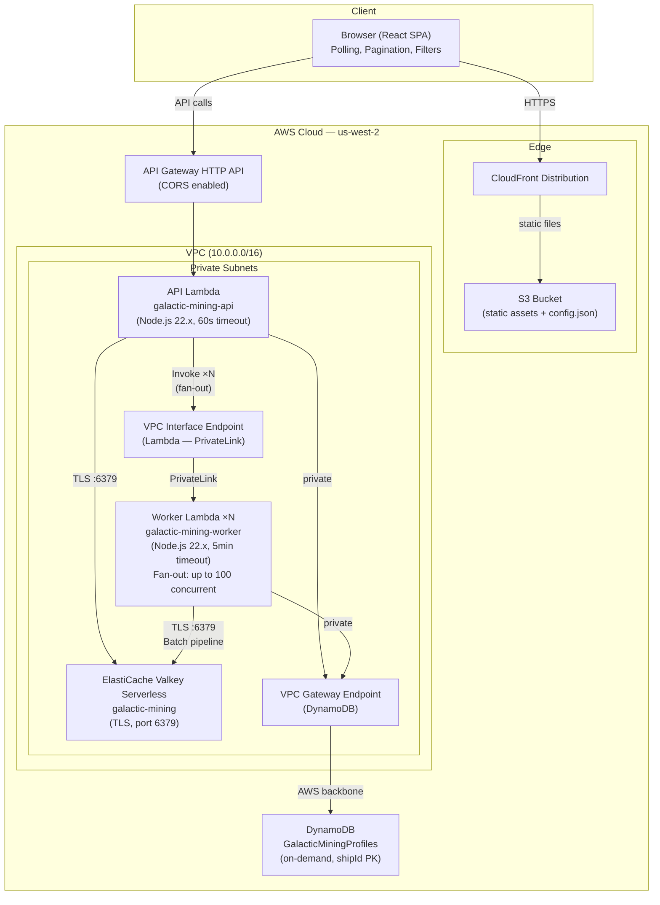
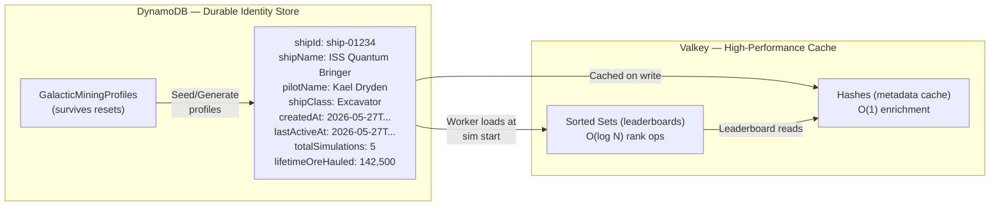
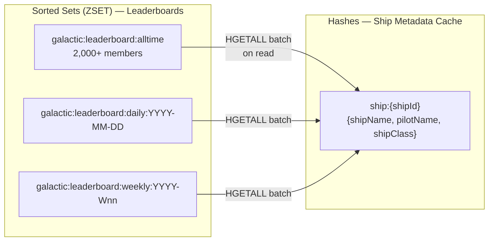
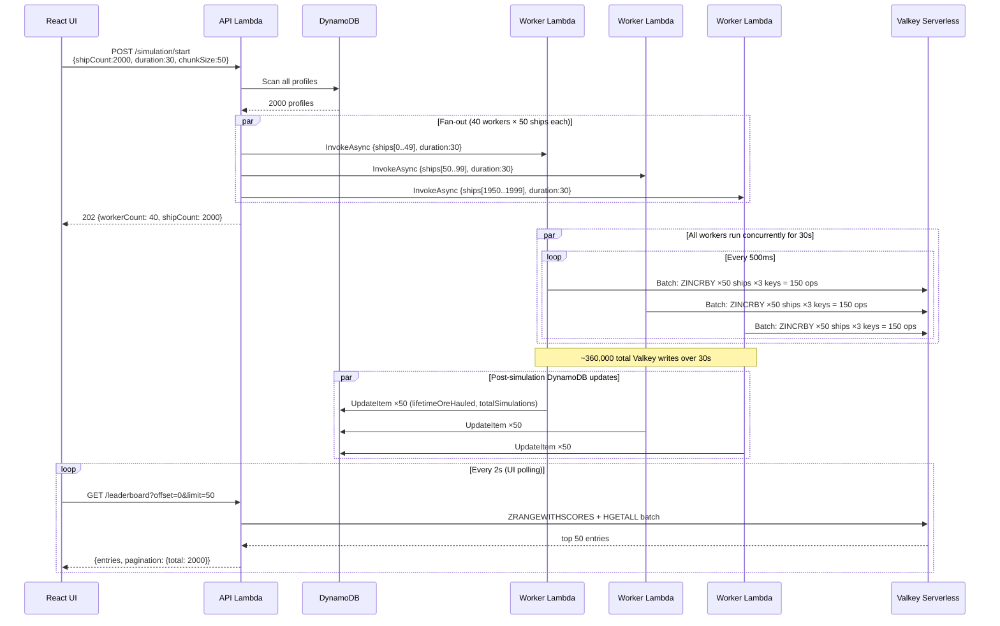

# Galactic Mining League — Architecture

## System Diagram



## Data Flow: Two-Tier Storage



## Data Model (Valkey)



## API Routes

| Method | Path | Backend | Feature |
|--------|------|---------|---------|
| `GET` | `/leaderboard?window=&date=&week=&offset=&limit=&shipClass=` | `ZRANGEWITHSCORES`, `ZCARD`, `HGETALL` batch | Paginated, filterable leaderboard |
| `GET` | `/leaderboard/windows` | `SCAN` pattern match | Discover all available date/week keys |
| `GET` | `/leaderboard/stats` | `ZCARD` ×3 | Ship counts per window |
| `GET` | `/leaderboard/above/{threshold}?window=` | `ZCOUNT`, `ZRANGEWITHSCORES` byScore | Score threshold filter |
| `GET` | `/ships` | DynamoDB `Scan` | List all profiles |
| `GET` | `/ships/{id}` | DynamoDB `GetItem` + `ZREVRANK`, `ZSCORE` | Profile with live rank |
| `GET` | `/ships/{id}/rank?window=` | `ZREVRANK`, `ZSCORE`, `HGETALL` | Rank in specific window |
| `POST` | `/ships` | DynamoDB `PutItem` + `HSET` | Create profile |
| `POST` | `/ships/seed` | DynamoDB `BatchWrite` + `HSET` batch | Seed 20 starter profiles |
| `POST` | `/ships/generate` | DynamoDB `BatchWrite` ×N | Generate 100–5000 synthetic profiles |
| `POST` | `/ships/{id}/score` | `ZINCRBY` or `ZADD GT` + `HSET` | Manual score update |
| `POST` | `/simulation/start` | DynamoDB `Scan` + Lambda `Invoke` ×N | Fan-out fleet simulation |
| `POST` | `/leaderboard/topn` | `ZREMRANGEBYRANK`, `ZCARD` | Prune to top-N |
| `DELETE` | `/leaderboard` | `DEL`, `SCAN` + `DEL` | Full leaderboard reset |

## Simulation Flow (Fan-Out Architecture)



## Valkey Features Demonstrated

| Valkey Feature | How It's Used | Scale Tested |
|---|---|---|
| **Sorted Sets (ZSET)** | Core leaderboard data structure — O(log N) rank lookups | 2,000+ members |
| **ZINCRBY** | Cumulative score mode (atomic increment) | 6,000 ops/tick × 60 ticks |
| **ZADD GT** | "Best score" mode — only replace if new > stored | Same throughput |
| **ZADD NX** | Initialize without overwriting existing scores | 2,000 per sim start |
| **ZRANGEWITHSCORES** | Paginated retrieval (offset/limit via index range) | Page through 2K entries |
| **ZRANGEBYSCORE** | Score threshold filter + ship class filter (over-fetch + filter) | Filter across full set |
| **ZREVRANK** | O(log N) individual rank lookup | Per-profile queries |
| **ZCOUNT** | Count members in score range | Threshold badge |
| **ZCARD** | Total member count per window | Stats cards |
| **ZREMRANGEBYRANK** | Top-N cap enforcement per tick | Prune to top 10–500 |
| **HSET / HGETALL** | Ship metadata cache (fast enrichment on reads) | Batch 50–100 per page |
| **SCAN** | Safe key enumeration (reset, window discovery) | Pattern: `galactic:leaderboard:*` |
| **Pipelining (Batch)** | Bulk operations — one round-trip per tick per worker | 150 ops/batch × 40 workers |
| **TLS** | Encrypted transport (required by Serverless) | All connections |
| **Concurrent writers** | 40 Lambda workers writing to same sorted sets simultaneously | Valkey handles lock-free |

## Infrastructure (CDK)

```
galactic-mining-league/
├── bin/                      # CDK app entry point
├── lib/                      # CDK stack definition
│   └── galactic-mining-league-stack.ts
│       ├── VPC (2 AZ, NAT Gateway)
│       ├── Security Groups (Lambda ↔ Valkey)
│       ├── ElastiCache Valkey Serverless
│       ├── DynamoDB Table (PAY_PER_REQUEST)
│       ├── Lambda: API (NodejsFunction, esbuild bundled)
│       ├── Lambda: Worker (NodejsFunction, esbuild bundled)
│       ├── API Gateway HTTP API (9 route paths)
│       ├── S3 + CloudFront (OAC, SPA routing)
│       └── BucketDeployment (frontend + config.json)
├── lambda/
│   ├── api/handler.js        # All API routes (GLIDE + DynamoDB)
│   ├── worker/handler.js     # Simulation engine (fan-out ready)
│   └── package.json          # @valkey/valkey-glide + @aws-sdk
├── frontend/
│   ├── src/
│   │   ├── App.tsx           # Polling, pagination, filters, tabs
│   │   ├── api.ts            # API client (typed)
│   │   ├── types.ts          # TypeScript interfaces
│   │   └── components/
│   │       ├── Leaderboard.tsx       # Table with rank, bars, badges
│   │       └── SimulationControls.tsx # Fleet size, duration, mode, cap
│   └── build/                # Production build → S3
├── ARCHITECTURE.md           # This file
└── cdk.out/                  # Synthesized CloudFormation
```

## Key Design Decisions

| Decision | Rationale |
|---|---|
| Valkey for leaderboard, DynamoDB for profiles | Sorted sets give O(log N) rank ops; DynamoDB gives durable identity that survives resets |
| Fan-out workers (not single Lambda) | Simulates realistic concurrent writer load; tests Valkey's lock-free sorted set under contention |
| `HSET` cache on every write | Avoids DynamoDB read on every leaderboard page render; Valkey hash is the "hot" metadata path |
| Server-side class filter via over-fetch | No native secondary index in sorted sets; scan-and-filter is fast enough for demo scale |
| Pagination via ZRANGEWITHSCORES offset | O(log N + M) — efficient for any page depth in Valkey |
| Time-windowed keys (daily/weekly/alltime) | Separate sorted sets per window = independent TTL, no cross-contamination |
| `ZADD GT` vs `ZINCRBY` toggle | Demonstrates two common leaderboard patterns in one demo |
| `ZREMRANGEBYRANK` per tick | Shows real-time pruning under write load |
