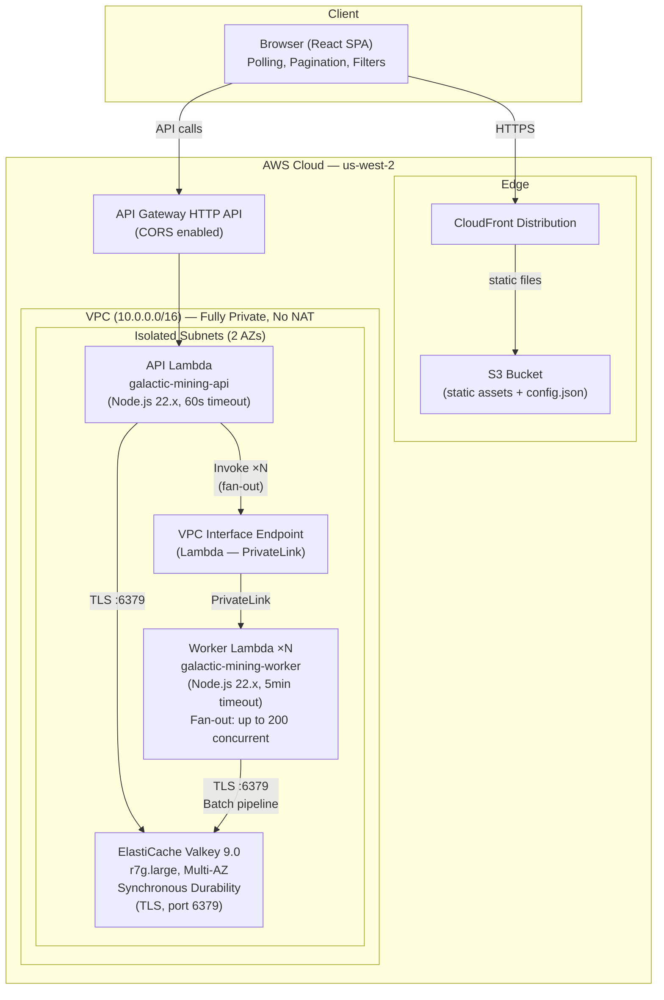
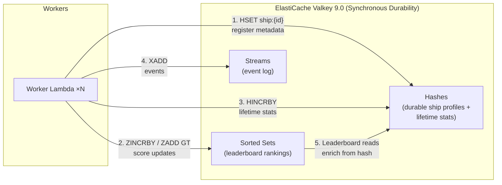
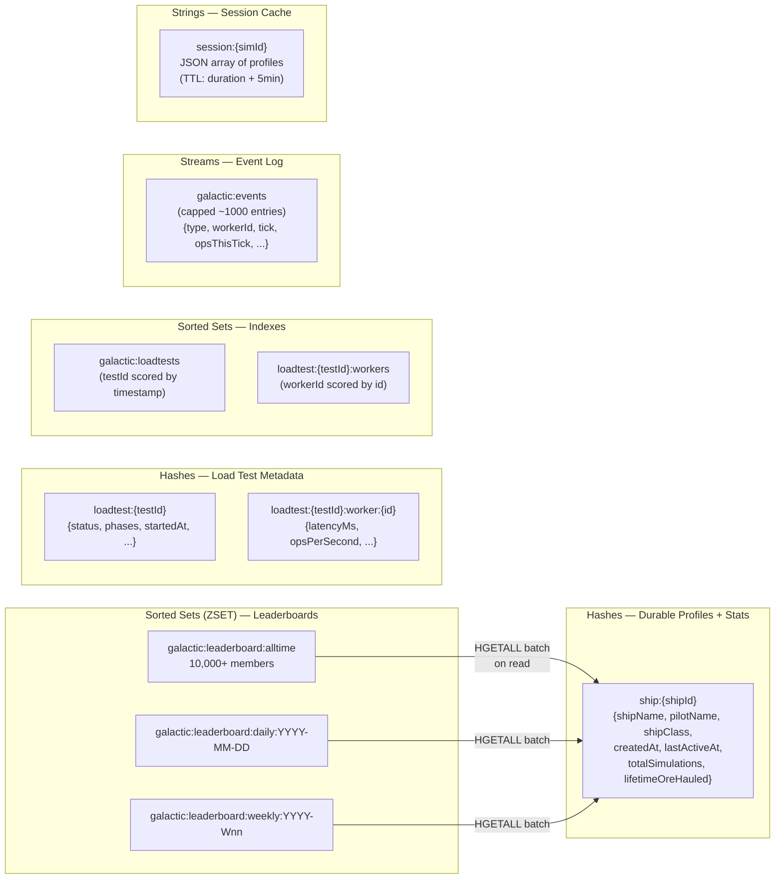
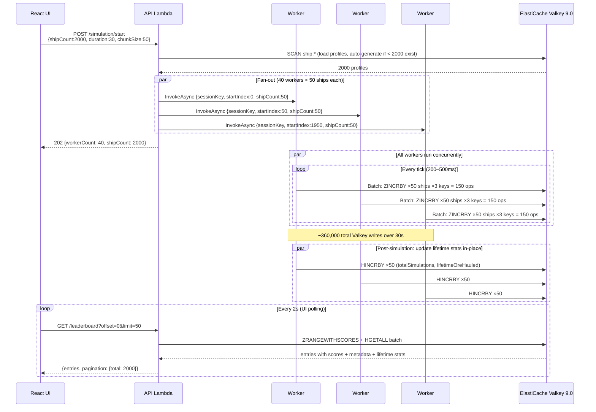
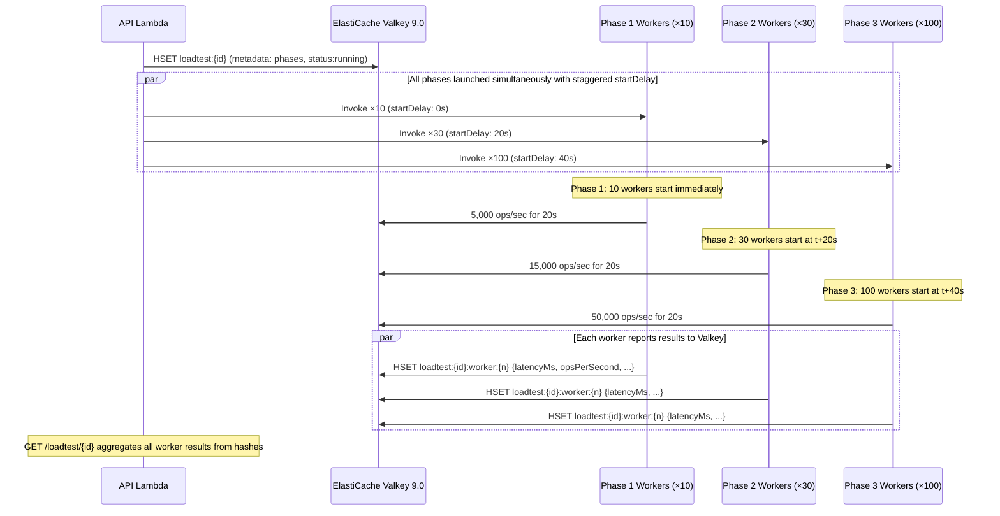

# Galactic Mining League — Architecture

## System Diagram



All traffic stays on AWS private networking. No NAT gateway, no internet egress. Lambda invocation via Interface Endpoint (PrivateLink). ElastiCache cluster in the same isolated subnets.

## Data Flow: Single-Tier Durable Pattern



With synchronous durability, every write to a hash or sorted set is persisted across at least two AZs before the response returns to the client. No separate database needed — Valkey **is** the durable store.

The flow:
1. Worker registers ship metadata in hash (durable on write)
2. Mining loop: atomic score updates to sorted sets across 3 time windows
3. Post-simulation: `HINCRBY` increments lifetime counters directly in the hash
4. Workers emit events to a capped stream throughout
5. Leaderboard reads combine sorted set rank/score with hash metadata in one pipeline

## Data Model (Valkey)



## API Routes

| Method | Path | Backend | Feature |
|--------|------|---------|---------|
| `GET` | `/leaderboard?window=&date=&week=&offset=&limit=&shipClass=` | `ZRANGEWITHSCORES`, `ZCARD`, `HGETALL` batch | Paginated, filterable leaderboard |
| `GET` | `/leaderboard/windows` | `SCAN` pattern match | Discover all available date/week keys |
| `GET` | `/leaderboard/stats` | `ZCARD` ×3 | Ship counts per window |
| `GET` | `/leaderboard/above/{threshold}?window=&shipClass=` | `ZRANGEWITHSCORES` byScore + `HGETALL` batch | Score threshold + class filter |
| `GET` | `/ships` | `SCAN ship:*` + `HGETALL` batch | List all profiles |
| `GET` | `/ships/{id}` | `HGETALL` + `ZREVRANK`, `ZSCORE` | Profile with live rank |
| `GET` | `/ships/{id}/rank?window=` | `ZREVRANK`, `ZSCORE`, `HGETALL` | Rank in specific window |
| `POST` | `/ships` | `HSET` | Create profile |
| `POST` | `/ships/seed` | `HSET` batch | Seed 20 starter profiles |
| `POST` | `/ships/generate` | `HSET` batch ×N | Generate 100–5000 synthetic profiles |
| `POST` | `/ships/{id}/score` | `ZINCRBY` or `ZADD GT` | Manual score update |
| `POST` | `/simulation/start` | `SCAN` + Lambda `Invoke` ×N | Fan-out fleet simulation |
| `POST` | `/leaderboard/topn` | `ZREMRANGEBYRANK`, `ZCARD` | Prune to top-N |
| `GET` | `/events?since=&limit=` | `XRANGE`, `XLEN` | Incremental event stream consumption |
| `POST` | `/loadtest/start` | `HSET` + Lambda `Invoke` ×N (phased) | Phased load test with ramp-up |
| `GET` | `/loadtest/{id}` | `HGETALL` + aggregate worker results | Load test results with latency percentiles |
| `GET` | `/loadtests` | `ZRANGEWITHSCORES` index + `HGETALL` batch | List all load tests |
| `DELETE` | `/leaderboard` | `DEL`, `SCAN` + `DEL` | Full leaderboard reset |

## Simulation Flow (Fan-Out Architecture)



## Load Test Flow (Phased Ramp-Up)



## Valkey Features Demonstrated

| Valkey Feature | How It's Used | Scale Tested |
|---|---|---|
| **Sorted Sets (ZSET)** | Core leaderboard data structure — O(log N) rank lookups | 10,000+ members |
| **ZINCRBY** | Cumulative score mode (atomic increment) | 50,000 ops/sec sustained |
| **ZADD GT** | "Best score" mode — only replace if new > stored | Same throughput |
| **ZADD NX** | Initialize without overwriting existing scores | 10,000 per sim start |
| **ZRANGEWITHSCORES** | Paginated retrieval (offset/limit via index range) | Page through 10K entries |
| **ZRANGEBYSCORE** | Score threshold filter + class filter (over-fetch + filter) | Filter across full set |
| **ZREVRANK** | O(log N) individual rank lookup | Per-profile queries |
| **ZCOUNT** | Count members in score range | Threshold badge |
| **ZCARD** | Total member count per window | Stats cards |
| **ZREMRANGEBYRANK** | Top-N cap enforcement per tick | Prune to top 10–500 |
| **HSET / HGETALL** | Durable ship profiles + lifetime stats (source of truth) | Batch 50–200 per page |
| **HINCRBY** | Atomic counter increment for lifetime stats | Per-ship post-simulation |
| **XADD + MAXLEN** | Capped event stream — workers emit tick/start/complete events | ~1000 entries, auto-trimmed |
| **XRANGE** | Incremental stream reads — frontend polls with exclusive start ID | 20 events/poll, 1s interval |
| **XLEN** | Stream depth indicator in UI | Live count |
| **SET + EX** | Ephemeral session cache — profile data shared across workers via TTL key | 2000+ profiles, 5min TTL |
| **GET** | Workers read session cache to retrieve their ship slice | N concurrent readers, one key |
| **SCAN** | Safe key enumeration (reset, window discovery, profile listing) | Pattern: `ship:*`, `galactic:leaderboard:*` |
| **Pipelining (Batch)** | Bulk operations — one round-trip per tick per worker | 150 ops/batch × 100 workers |
| **TLS** | Encrypted transport (in-transit encryption enabled) | All connections |
| **Synchronous Durability** | Every write persisted across 2+ AZs before response | All writes — zero data loss design |
| **Concurrent writers** | Up to 200 Lambda workers writing to same sorted sets | Lock-free, linear scaling to 50K ops/sec |

## Infrastructure (CDK)

```
galactic-mining-league/
├── bin/                      # CDK app entry point
├── lib/                      # CDK stack definition
│   └── galactic-mining-league-stack.ts
│       ├── VPC (2 AZ, isolated subnets, no NAT)
│       ├── VPC Endpoint (Lambda PrivateLink)
│       ├── Security Groups (Lambda ↔ Valkey)
│       ├── ElastiCache Replication Group (Valkey 9.0, r7g.large, Multi-AZ, Sync Durability)
│       ├── Lambda: API (NodejsFunction, esbuild bundled)
│       ├── Lambda: Worker (NodejsFunction, esbuild bundled)
│       ├── API Gateway HTTP API (17 route paths)
│       ├── S3 + CloudFront (OAC, SPA routing)
│       └── BucketDeployment (frontend + config.json)
├── lambda/
│   ├── api/handler.js        # All API routes (GLIDE client only)
│   ├── worker/handler.js     # Simulation engine (fan-out, latency tracking)
│   └── package.json          # @valkey/valkey-glide + @aws-sdk/client-lambda
├── frontend/
│   ├── src/
│   │   ├── App.tsx           # Polling, pagination, filters, tabs
│   │   ├── api.ts            # API client (typed)
│   │   ├── types.ts          # TypeScript interfaces
│   │   └── components/
│   │       ├── Leaderboard.tsx       # Table with rank, bars, lifetime stats
│   │       └── SimulationControls.tsx # Fleet size, duration, mode, cap, chunk size
│   └── build/                # Production build → S3
├── ARCHITECTURE.md           # This file
└── cdk.out/                  # Synthesized CloudFormation
```

## Key Design Decisions

| Decision | Rationale |
|---|---|
| ElastiCache with synchronous durability as sole data store | Valkey 9.0 durability eliminates the need for a separate database — sorted sets give O(log N) rank ops, hashes give durable profile storage, all in one service |
| Node-based (r7g.large) over Serverless | Predictable performance characteristics for load testing; explicit control over instance type and Multi-AZ topology |
| Synchronous over asynchronous durability | Zero data loss guarantee — every write confirmed across 2+ AZs before response. Profile data and lifetime stats cannot tolerate any loss window |
| `HINCRBY` for lifetime stats | Atomic increment directly in the hash — no read-modify-write cycle, no separate counter table, no eventual consistency |
| Fan-out workers (not single Lambda) | Simulates realistic concurrent writer load; tests lock-free sorted set behavior under contention |
| Fully private VPC (no NAT) | Lambda PrivateLink = zero egress cost, all traffic on AWS backbone |
| Server-side class filter via over-fetch | No native secondary index in sorted sets; scan-and-filter with early-exit is fast enough at scale |
| Pagination via ZRANGEWITHSCORES offset | O(log N + M) — efficient for any page depth |
| Time-windowed keys (daily/weekly/alltime) | Separate sorted sets per window = independent lifecycle, no cross-contamination |
| `ZADD GT` vs `ZINCRBY` toggle | Demonstrates two common leaderboard patterns (cumulative vs. high-score) in one UI toggle |
| `ZREMRANGEBYRANK` per tick | Shows real-time pruning under write load |
| Streams over Pub/Sub for events | Streams persist (replay from any point), Pub/Sub doesn't — Lambda can't hold subscriptions, so polling XRANGE with `since` is the right pattern |
| Session cache with TTL (SET EX) | Avoids Lambda 256KB payload limit at scale; one Valkey write replaces N copies of profile data in invoke payloads |
| Phased load test with startDelay | Workers sleep before starting to create a realistic ramp-up curve, measuring where latency degrades |
| Per-worker latency percentiles via hrtime | Measures actual Valkey pipeline round-trip time (not Lambda overhead) for accurate characterization |
